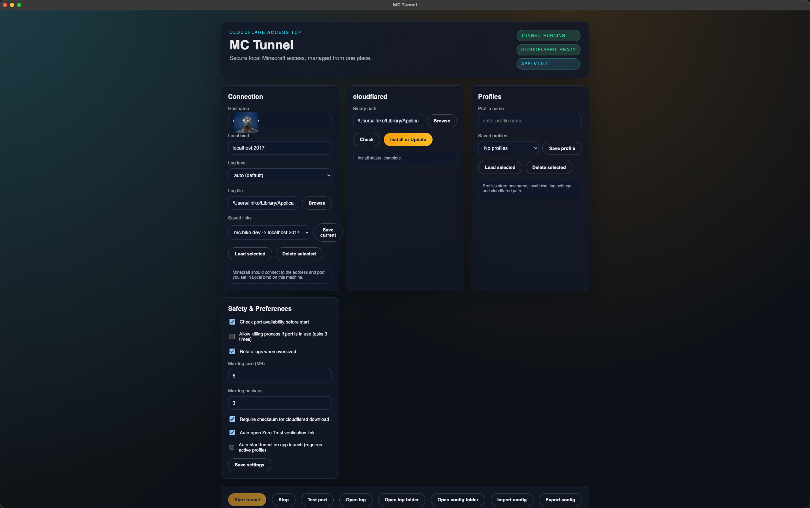
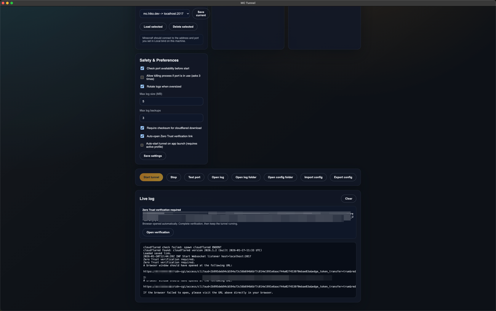

# MC Tunnel UI

<p align="center">
  
</p>

[](https://github.com/HikoPLi/MC-Tunnel/actions/workflows/ci.yml)
[](https://github.com/HikoPLi/MC-Tunnel/releases)
[](LICENSE)

MC Tunnel UI is a cross-platform Electron desktop app for running Cloudflare Access TCP tunnels to a local Minecraft server, with explicit controls and operational safety guardrails.

## 中文速览

- 支持多 `Hostname` 一次配置与运行。
- 支持连接列表中逐条 `Start`/`Stop` 控制。
- `Start tunnel` 可重复点击以追加启动新 Host，不会因已有连接而永久禁用。
- `local bind` 可选；留空时自动分配可用端口。
- 优先复用本地已安装 `cloudflared`（含 `userData/bin` 托管路径），避免重复下载。
- 当 `cloudflared` 二进制文件被占用时，安装会自动侧装到新文件名而非直接失败。

## Why This Project

- Provide a safe, explicit UI for Cloudflare Access TCP usage.
- Avoid hidden behavior and silent fallbacks.
- Keep runtime behavior predictable on macOS, Windows, and Linux.

## Core Capabilities

- Multi-host tunnel orchestration in one profile.
- Per-connection runtime controls (`Start`/`Stop`) from a live connection list.
- Incremental start: you can add and start more hosts while existing hosts are already running.
- Optional auto-allocation of local binds when `local bind` is not provided.
- App package update checker (GitHub Releases) with background mode, skip-version option, and explicit install prompt.
- Preflight bind checks and optional process-kill confirmation flow for occupied ports.
- Cloudflared lifecycle management:
  - Check configured binary.
  - Install latest compatible asset.
  - Reuse managed local binary (`userData/bin`) on startup and runtime checks.
  - Handle busy binary replacement by side-by-side install fallback.
- Log persistence, rotation, and quick file/folder access from UI.
- Config import/export and profile management.

## Operational Guarantees

- `Start tunnel` is never permanently disabled by running state. It is disabled only while one start request is in flight.
- Existing running connections are preserved when appending new hosts.
- Omitted local bind entries are auto-assigned to available local ports, without overriding explicit bind entries.
- cloudflared resolution and reuse follows a deterministic order:
  1. Configured binary path.
  2. `cloudflared` in `PATH`.
  3. Managed binaries under app `userData/bin`.
- If managed binary replacement is blocked by file occupancy, install falls back to side-by-side naming and continues.

## Safety Model

- No implicit hostname generation.
- Local bind is explicit when provided; otherwise auto-assigned from available ports.
- Port conflict handling is explicit and confirm-driven.
- Destructive actions (killing occupying processes) require user confirmation.
- Optional checksum enforcement for downloaded cloudflared assets.
- Background app-update checks are opt-in and can be disabled in settings.

## Screenshots

Updated UI demo (2026-02-08):




## Requirements

- Node.js `>=18`
- npm
- A working Cloudflare Zero Trust + Access setup for your hostname(s)

## Quick Start (Users)

1. Download and install the release package for your OS from GitHub Releases.
2. Open the app and fill in:
   - `Hostname(s)`: comma/newline/semicolon separated.
   - `Local bind(s)` (optional): comma/newline/semicolon separated.
3. Use `Check` to validate cloudflared, or `Install/Update` to install managed cloudflared.
4. Click `Start tunnel`.
5. Complete Zero Trust verification in browser when prompted.
6. Connect Minecraft client to the local bind(s).

## Multi-Host Runtime Semantics

- `Start tunnel` can be used repeatedly.
- If some hosts are already running, new hosts are appended and started.
- Existing running connections are not duplicated when the same `hostname + local bind` pair is provided.
- Each connection is listed in `Tunnel Connections` with independent `Start`/`Stop` controls.

## Local Bind Behavior

- If `local bind` is provided, it is validated and checked before use.
- If `local bind` is omitted, the app allocates an available local port automatically.
- If a bind is already used by another running connection, start is blocked with an explicit error.

## Cloudflared Behavior (Important)

- Priority order during runtime checks:
  1. User-configured path (if valid).
  2. `cloudflared` in `PATH`.
  3. Managed binary in app `userData/bin`.
- On macOS and other platforms, managed binaries are reused; no repeated download is required once installed.
- If replacing a binary fails because the file is busy/in use, install falls back to side-by-side binary naming and continues.

## Cloudflare Prerequisites

This app wraps:

```bash
cloudflared access tcp --hostname <app-hostname> --url <localBind>
```

You still need:

1. A Cloudflare Access app protecting your target hostname(s).
2. Proper Access policy allowing intended users.
3. Reachable origin service behind Cloudflare (commonly via Cloudflare Tunnel).

For detailed architecture/security discussion, see `WHITEPAPER.md`.

## Configuration Model

- Saved links store `hostname + local bind` pair set.
- Profiles store full runtime config:
  - hostname(s)
  - local bind(s)
  - log level
  - log file
  - cloudflared path
- Auto-start uses the active profile only.
- Config is stored in app user data directory.

## Troubleshooting

### `cloudflared not found` or execution failed

- Use `Check` first.
- If check fails, use `Install/Update`.
- Verify executable permissions and path in profile.

### Port already in use

- Enable preflight check.
- Either choose another bind or allow process-kill flow (with confirmation).
- Verify no other running connection in this app is already bound to the same local address.

### Cannot verify Access URL

- Ensure browser session is logged in with an allowed identity.
- Confirm Access policy allows your user/group.

### Start button behavior

- `Start tunnel` remains available for incremental host start.
- During one in-flight start request, repeated rapid clicks are ignored to avoid duplicate requests.

## Manual Smoke Test (Maintainers)

1. Launch app with `npm run start`.
2. Load a profile containing at least 2 hostnames and one empty local bind entry.
3. Click `Start tunnel`; verify at least one connection shows `auto-assigned`.
4. While first connection is running, add another hostname and click `Start tunnel` again.
5. Verify the new connection appears without stopping existing ones.
6. Use per-connection `Stop` and `Start` to confirm independent control.
7. Run `Check` for cloudflared and verify path reuse on restart.
8. Trigger `Install/Update` and verify status/log output is actionable.

## Development

```bash
npm install
npm run start
```

### Test

```bash
npm test
```

### Package

```bash
npm run pack
npm run pack:dir
```

## Repository Structure

- `src/main/`: Electron main process.
- `src/renderer/`: UI and renderer scripts.
- `tests/`: Node-based validation tests.
- `WHITEPAPER.md`: architecture, security, and risk analysis.
- `CHANGELOG.md`: release notes.

## Documentation

- Changelog: [CHANGELOG.md](CHANGELOG.md)
- Whitepaper: [WHITEPAPER.md](WHITEPAPER.md)

## Image Credits

- [Feather Icons](https://github.com/feathericons/feather) (MIT License)
- [Cloud_server.svg](https://commons.wikimedia.org/wiki/File:Cloud_server.svg) (CC0 1.0)
- [NetworkTopologies.svg](https://commons.wikimedia.org/wiki/File:NetworkTopologies.svg) (Public domain)

## License

MIT. See [LICENSE](LICENSE).

## IP and Trademarks

Copyright (c) 2026 LiYanpei, Hiko.

Source code is MIT licensed. Project name, logo, and branding are not granted under MIT and remain property of their respective owners. No trademark rights are granted.
